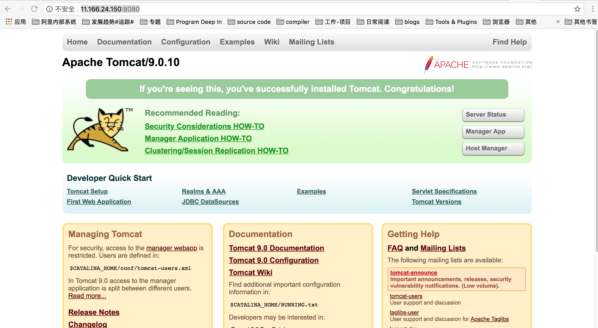
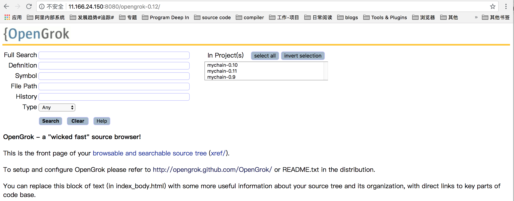

OpenGrok Requirements: https://github.com/oracle/opengrok/wiki/How-to-setup-OpenGrok  
1. JDK 1.8 or higher  
2. OpenGrok '''binaries''' from https://github.com/OpenGrok/OpenGrok/releases   
3. A servlet container like GlassFish or Tomcat 8.0 or later also running with Java at least 1.8  
4. a recent browser for clients - IE, Firefox, recent Chrome or Safari  
5. Optional tuning (see https://github.com/oracle/opengrok/wiki/Tuning-for-large-code-bases)  

#### 平台配置
**Linux系统版本:**  
```
$ uname -a
Linux mychain-xiaotian-01.inc.net 3.10.0-327.ali2010.rc7.alios7.x86_64 #1 SMP Thu Jun 29 21:45:21 CST 2017 x86_64 x86_64 x86_64 GNU/Linux
```
**ctags版本：**  
```
$ ctags --version
Exuberant Ctags 5.8, Copyright (C) 1996-2009 Darren Hiebert
  Compiled: Jun  9 2015, 21:42:14
  Addresses: <dhiebert@users.sourceforge.net>, http://ctags.sourceforge.net
  Optional compiled features: +wildcards, +regex
```

## 1. Java环境配置 
1.通过 sudo yum install java 或者 sudo apt-get install java安装java 1.8.x版本(已有java1.8版本可跳过该步骤)  
2. 查看设备Java版本号，确保$ java -version 为 java version "1.8.x"及以上版本  
3. 在 .bash_prifile中配置JAVA_HOM为安装目录  

```
########--java environment setting--#######
 export JAVA_HOME="/opt/yaozhongxiao/java" 
```
 
## 2. Tomcat环境配置
1. 从 https://tomcat.apache.org/download-90.cgi 下载tomcat9.0版至/opt/yaozhongxiao/apache-tomcat-9.0.10.tar.gz  
2. 解压至/opt/yaozhongxiao/apache-tomcat-9.0.10  
3. 为Tomcat 设置CATALINA_HOME环境变量

```
########--java environment setting--#######
 export CATALINA_HOME="/opt/yaozhongxiao/apache-tomcat-9.0.10"
```

4. 为Tomcat 设置CATALINA_HOME环境变量  
5. 启动(关闭)tomcat  

bash /opt/yaozhongxiao/apache-tomcat-9.0.10/bin/startup.sh
```
Using CATALINA_BASE:   /opt/yaozhongxiao/apache-tomcat-9.0.10
Using CATALINA_HOME:   /opt/yaozhongxiao/apache-tomcat-9.0.10
Using CATALINA_TMPDIR: /opt/yaozhongxiao/apache-tomcat-9.0.10/temp
Using JRE_HOME:        /opt/yaozhongxiao/java
Using CLASSPATH:       /opt/yaozhongxiao/apache-tomcat-9.0.10/bin/bootstrap.jar:/opt/yaozhongxiao/apache-tomcat-9.0.10/bin/tomcat-juli.jar
Tomcat started.
```

在浏览器中输入 http://11.166.24.150:8080/检查tomcat是否正常启动  

*  (如果报404错误，可能是端口被禁止，可以通过iptables命令检查和开放端口访问)

## 3. OpenGrok搭建
OpenGrok目前的版本不断演进：https://github.com/oracle/opengrok/releases
但是强烈建议不要采用最新版本(根据实测发现虽然可以完成OpenGrok环境的搭建，但极大可能发生无法为代码建立索引的情况，该问题排查数天无果，转而基于低版本搭建成功)
如下版本存在各自的问题  
(1). https://github.com/oracle/opengrok/releases/tag/1.1-rc38 无法完成代码的符号解析  
(2). https://github.com/oracle/opengrok/releases/tag/0.12.1.5   
(3). https://github.com/oracle/opengrok/releases/tag/0.13-rc10  

1. 从 https://github.com/oracle/opengrok/releases/tag/0.12.1.5 下载并解压至 /opt/yaozhongxiao/opengrok-0.12.1.5  
2. 为OpenGrok配置环境  

```
export OPENGROK_PATH="/opt/yaozhongxiao/opengrok-0.12.1.5"
```

3. 按照如下命令创建索引  
（特别需要注意的是,默认的tomcat中webapp-context为"source",
-w opengrok无法修改默认的webapp-context为opengrok；而是必须包含export OPENGROK_WEBAPP_CONTEXT=opengrok,  
其中opengrok可以的部署在${OPENGROK_TOMCAT_BASE}/webapps/webapp-context中webapp-context的名字  
并且-w 和OPENGROK_WEBAPP_CONTEXT必须保持一致)

[could not append options when using "bin/OpenGrok index" #1086](https://github.com/oracle/opengrok/issues/1086)

https://stackoverflow.com/questions/35273644/opengrok-http-status-404-source-s-when-trying-to-open-cpp-file-via-an-xref

```  
  2 #****************************************************************#
  3 # ScriptName: opengrok_indexing.sh
  4 # Author: zhongxiao.yzx
  5 # Create Date: 2018-08-22
  6 #***************************************************************#
  7 
  8 opengrok_path="/opt/yaozhongxiao/opengrok-0.13-rc10"
  9 source_root="${opengrok_path}/source/mychain"
 10 indexing_root="${opengrok_path}/source/indexing"
 11 
 12 # indexing for the source code
 13 # 1. remove the old indexing if exist
 14 if [ -d ${indexing_root}/ ];then
 15     rm -rf ${indexing_root}/
 16 fi
 17 mkdir -p ${indexing_root}
 18 
 19 # 2. export the OpenGrok environment variables
 20 export OPENGROK_TOMCAT_BASE=/opt/yaozhongxiao/apache-tomcat-9.0.10
 21 export OPENGROK_WEBAPP_CONTEXT=opengrok
 22 
 23 export JAVA_OPTS="-Xmx1024m"
 24 # java -jar ${opengrok_path}/lib/opengrok.jar for command help
 25 java $JAVA_OPTS -jar ${opengrok_path}/lib/opengrok.jar -P -S -v \
 26 -s ${source_root} \
 27 -d ${indexing_root} \
 28 -W ${indexing_root}/configuration.xml \
 29 -w opengrok # webapp-context  ${OPENGROK_TOMCAT_BASE}/webapps/webapp-context 
```

4. 将OpenGrok部署至Tomacat  
   (1). 将opengrok应用部署至tomcat容器  
   拷贝/opt/yaozhongxiao/opengrok-0.12.1.5/lib/source.war至/opt/yaozhongxiao/apache-tomcat-9.0.10/webapps/目录下，webapps/source.war会自动解压为webapps/source，该source名即为web访问的应用名，可以将source修改为自定义的名字，如mychain变成/opt/yaozhongxiao/apache-tomcat-9.0.10/webapps/mychain；  
   (2). 将mychain应用定向为opengrok生成的索引应用  
   修改/opt/yaozhongxiao/apache-tomcat-9.0.10/webapps/mychain/WEB-INF/web.xml文件,将CONFIGURATION设置为实际的configuration.xml文件路径  

```
  4   <display-name>OpenGrok</display-name>
  5   <description>A wicked fast source browser</description>
  6   <context-param>
  7     <param-name>CONFIGURATION</param-name>
  8     <param-value>/opt/yaozhongxiao/opengrok-0.12.1.5/source/indexing/configuration.xml</param-value> 
  9     <description>Full path to the configuration file where OpenGrok can read it's configuration</description>
 10   </context-param>  
```

5. 启动tomcat，在线代码浏览  
bash /opt/yaozhongxiao/apache-tomcat-9.0.10/bin/startup.sh  

```
Using CATALINA_BASE:   /opt/yaozhongxiao/apache-tomcat-9.0.10
Using CATALINA_HOME:   /opt/yaozhongxiao/apache-tomcat-9.0.10
Using CATALINA_TMPDIR: /opt/yaozhongxiao/apache-tomcat-9.0.10/temp
Using JRE_HOME:        /opt/yaozhongxiao/java
Using CLASSPATH:       /opt/yaozhongxiao/apache-tomcat-9.0.10/bin/bootstrap.jar:/opt/yaozhongxiao/apache-tomcat-9.0.10/bin/tomcat-juli.jar
Tomcat started.
```

在浏览器中输入 http://11.166.24.150:8080/mychain 进行在线代码搜索，浏览  

opengrok-0.12.1.5  


opengrok-0.13-rc10  


OpenGrok工具最终调用opengrok.jar，具体的使用方式可以通过opengrok.jar获取帮助  

```
$ java -jar /opt/yaozhongxiao/opengrok-0.13-rc10/lib/opengrok.jar 
Usage: opengrok.jar [options] [subDir1 ..]
```

### 参考
[0]. opengrok安装使用指南: https://ox0spy.github.io/post/install/setup-opengrok/  
[1] OpenGrok-a wicked fast source browser : https://github.com/oracle/opengrok#5-contact-us  
[2] How to setup OpenGrok : https://github.com/oracle/opengrok/wiki/How-to-setup-OpenGrok  

